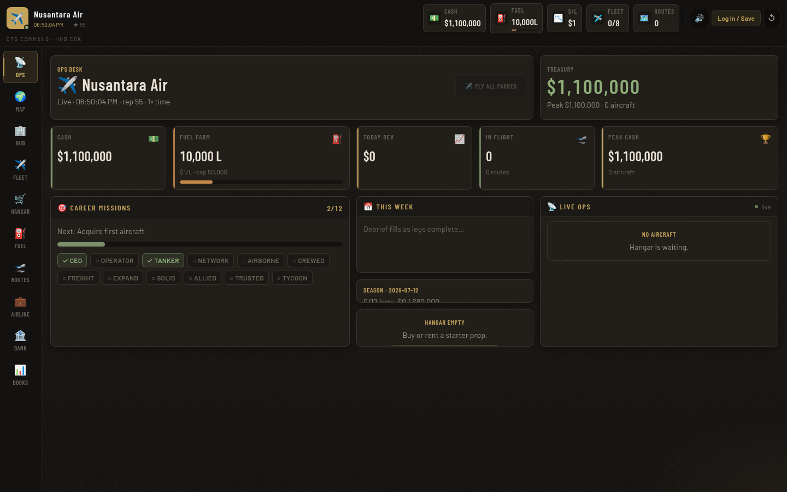
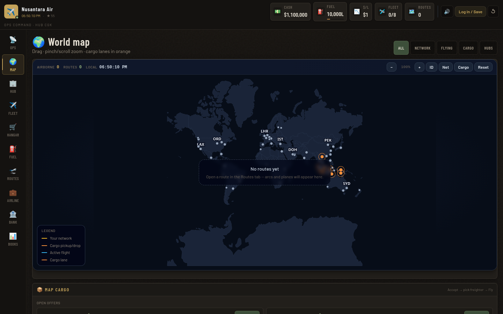
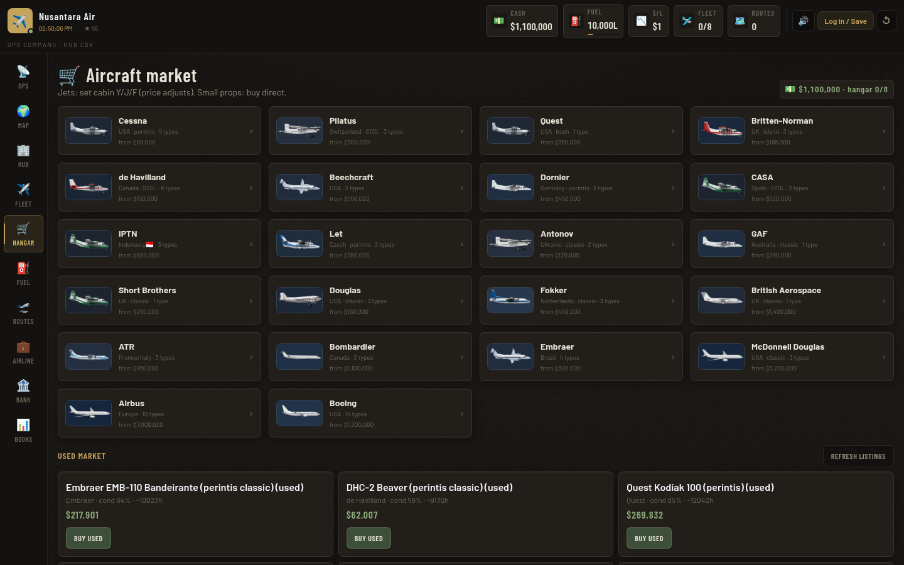
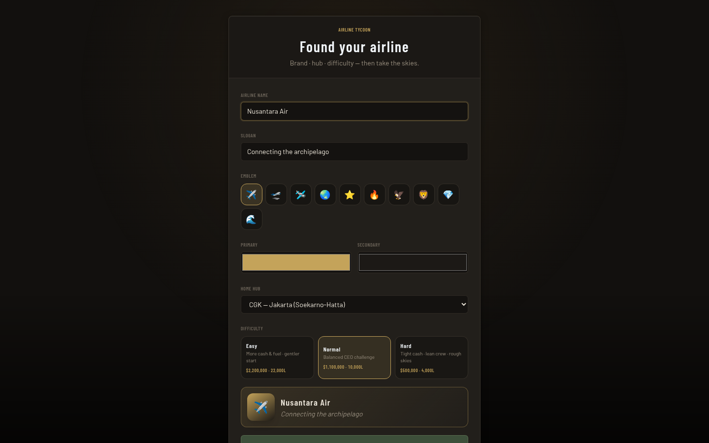
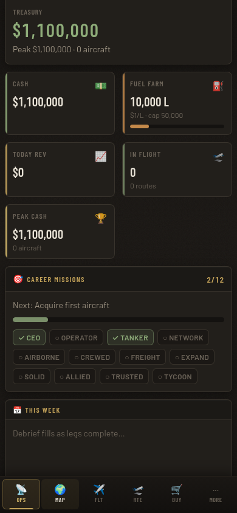
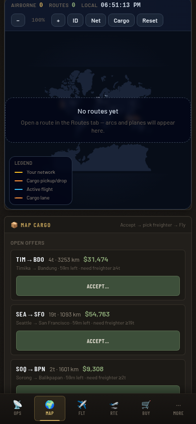
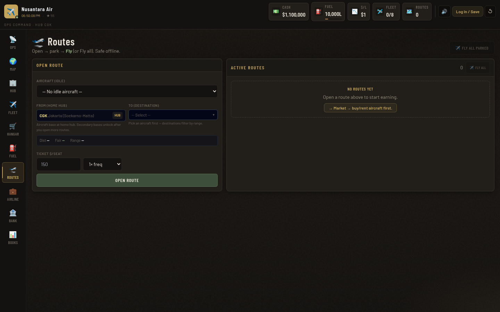

# Airline Tycoon

Web-based **airline management tycoon** — build a brand, lease props and jets, open routes, fly real-time sectors, and run cargo jobs across the map.

Not a flight simulator. You're the CEO.

<p align="center">
  
</p>

<p align="center">
  
  &nbsp;
  
</p>

<p align="center">
  
  &nbsp;
  
  &nbsp;
  
</p>

## Features

- **Found an airline** — name, emblem, hub, difficulty
- **Fleet market** — buy / lease from Cessna perintis to widebodies; used market too
- **Routes & real-time flight** — default **1× wall-clock**; optional 30× / 60×
- **World map** — network arcs, live aircraft, Indonesia fit, cargo lanes (orange)
- **Map cargo jobs** — accept → **pick freighter** → Assign / Assign & Fly
- **Fuel farm, bank loans, hubs & facilities, staff, season goals**
- **Save** — localStorage always; optional cloud login (SQLite + JWT)
- **Mobile** — bottom dock (Ops · Map · Fleet · Routes · Hangar · More)

## Stack

| Layer | Tech |
|-------|------|
| Client | React 18 · Vite · TypeScript · Tailwind · Zustand |
| Map | Custom SVG world map · great-circle routes |
| Server | Express · `node:sqlite` · JWT (`jose`) · bcrypt |

## Quick start

```bash
cd airline-tycoon
npm install
npm run dev
```

- **Web UI:** Vite URL (usually `http://localhost:5173`)
- **API:** `http://localhost:3001` (proxied as `/api` in dev)

## Deploy (Vercel)

```bash
npm i -g vercel
vercel login
vercel --prod
```

Set project env vars in Vercel (Production + Preview):

| Name | Notes |
|------|--------|
| `JWT_SECRET` | Long random string (min 16) |
| `ADMIN_USERNAME` | Optional admin seed |
| `ADMIN_PASSWORD` | Optional, min 6 |

**Cloud DB:** SQLite file is synced to **Vercel Blob** (`BLOB_READ_WRITE_TOKEN`) so player accounts survive cold starts. Guest play still uses browser localStorage.

```bash
npm run dev:server   # API only
npm run dev:client   # Vite only
npm run build        # production client
npx tsc -b           # typecheck
```

### Production-ish API

```bash
export JWT_SECRET='long-random-string'
npm run start:server
```

Database file: `server/data/airline-tycoon.db` (gitignored).

## Screenshots

| Ops desk | Hangar market |
|----------|----------------|
|  |  |

| World map + cargo | Routes |
|-------------------|--------|
|  |  |

| Found airline | Mobile |
|---------------|--------|
|  |  |

## How to play (short)

1. **Launch airline** (hub e.g. CGK).
2. **Hangar** — lease a small prop (or freighter for cargo).
3. **Fuel** — top up the farm.
4. **Routes** — open a route → **Fly** (or Fly all parked).
5. **Map → Cargo** — Accept… → pick freighter → **Assign & Fly**.
6. Optional: Airline → time scale 30× / 60× if real-time is too slow.

## Cloud login

1. **Log in / Save** in the top bar  
2. Register (username 3–24 chars, password ≥ 6)  
3. Progress auto-syncs while logged in  
4. Log in elsewhere → cloud save loads  

Guest play still works offline in that browser only.

## Env

| Variable | Default | Notes |
|----------|---------|--------|
| `PORT` | `3001` | API port |
| `JWT_SECRET` | — | **Required** for stable logins (min 16 chars). Put in local `.env` only |
| `ADMIN_USERNAME` | — | Optional; creates/promotes admin on API boot |
| `ADMIN_PASSWORD` | — | Optional; min 6 chars with username |
| `ADMIN_RESET_PASSWORD` | off | Set `1` only to force-reset admin password on next boot |

**Secrets never go in git.** Use a local file:

```bash
cp .env.example .env
# edit .env — JWT_SECRET, ADMIN_USERNAME, ADMIN_PASSWORD
npm run dev
```

`.env` is gitignored. Only `.env.example` (empty placeholders) is committed.

1. Fill local `.env` → `npm run dev`
2. **Log in / Save** with your admin username/password  
3. **🛡 Admin** → player list, gift cash, change password

## Project layout

```
src/
  components/   # UI panels (map, fleet, routes, bank, …)
  sim/          # economy, flights, fuel, cargo, season, …
  store/        # Zustand game + auth
  data/         # aircraft catalog, airports, rivals
server/         # Express API + SQLite cloud save
docs/screenshots/
```

## License

Private / WIP — all rights reserved unless stated otherwise.
